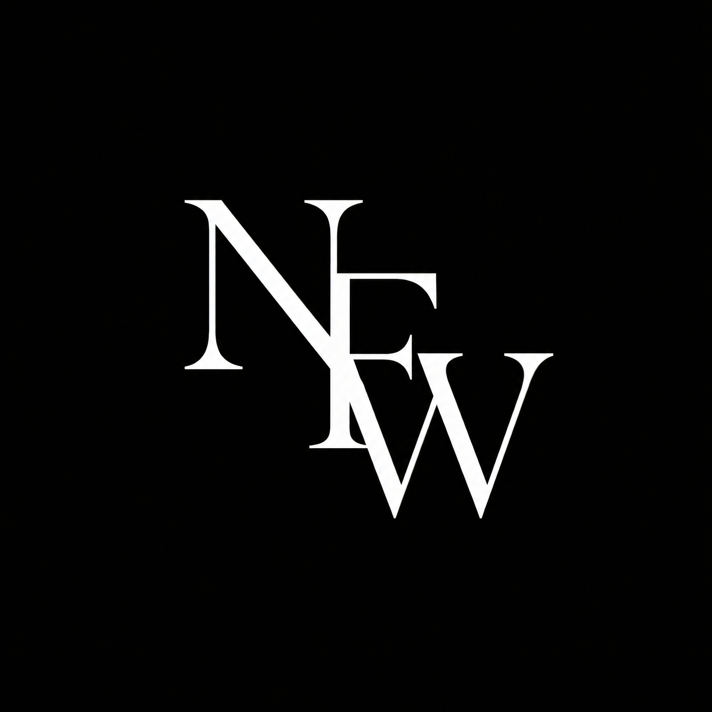

  

# NoFluffWisdom Landing Page

A premium, highly interactive cinematic landing page for **NoFluffWisdom** — an operating system for better thinking.

## Live Demo

Experience the interactive cinematic showcase live at:  
👉 **[https://andreyanv.github.io/NoFluffWisdom/](https://andreyanv.github.io/NoFluffWisdom/)**

> [!IMPORTANT]  
> For the smoothest scroll and video playback performance, please use a browser with **Hardware Acceleration** enabled in settings.

## Features

- **Dual-Video Background Engine with Crossfade Loop**: Seamless background video looping using dual `<video>` elements (`#heroVidA` and `#heroVidB`) with a JavaScript `timeupdate` crossfade engine that eliminates buffer pauses, stuttering, or black frame resets.
- **Unified RAF & IntersectionObserver Engine**: Drives smooth scroll progress indicators, sibling stagger reveal transitions, dynamic subscriber counter animation, and section visibility tracking in performance-optimized loops.
- **Mouse-Reactive Glassmorphism (`data-glass`)**: Real-time cursor tracking calculates localized radial gradient coordinates (`--mx`, `--my`) to project dynamic specular light highlights across frosted glass cards.
- **Adaptive Contrast & Auto-Hiding Navbar**: Automatically detects scroll direction and underlying band luminosity via `IntersectionObserver`, dynamically switching navbar text contrast over light/dark sections and auto-hiding during long-form reading.
- **Interactive Curated Shelf**: Modular showcase for flagship frameworks (*The Focus Protocol*, *Thinking in Systems*, *The Discipline Playbook*, *Books Worth Finishing*) featuring full-container bouncy hover transforms (`scale(1.04) translateY(-4px)`) and elevation shadow depth.
- **Modal Flow & Subscription Engine**: Interactive email form reveal with focus management and a frosted glass subscription confirmation modal featuring keyboard escape handlers and backdrop blur filters.

## Technologies Used

- **HTML5 & JavaScript** (Semantic architecture, IntersectionObservers, dual-video crossfade engine, and state management)
- **Vanilla CSS** (Mobile-first design system, Black Olive / Platinum palette tokens, glassmorphism, responsive grids, and hardware-accelerated transforms)
- **Google Fonts** (Geist, Instrument Serif, and IBM Plex Mono typography integration)
